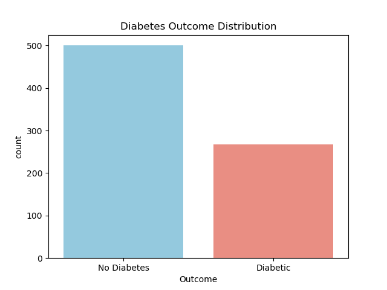
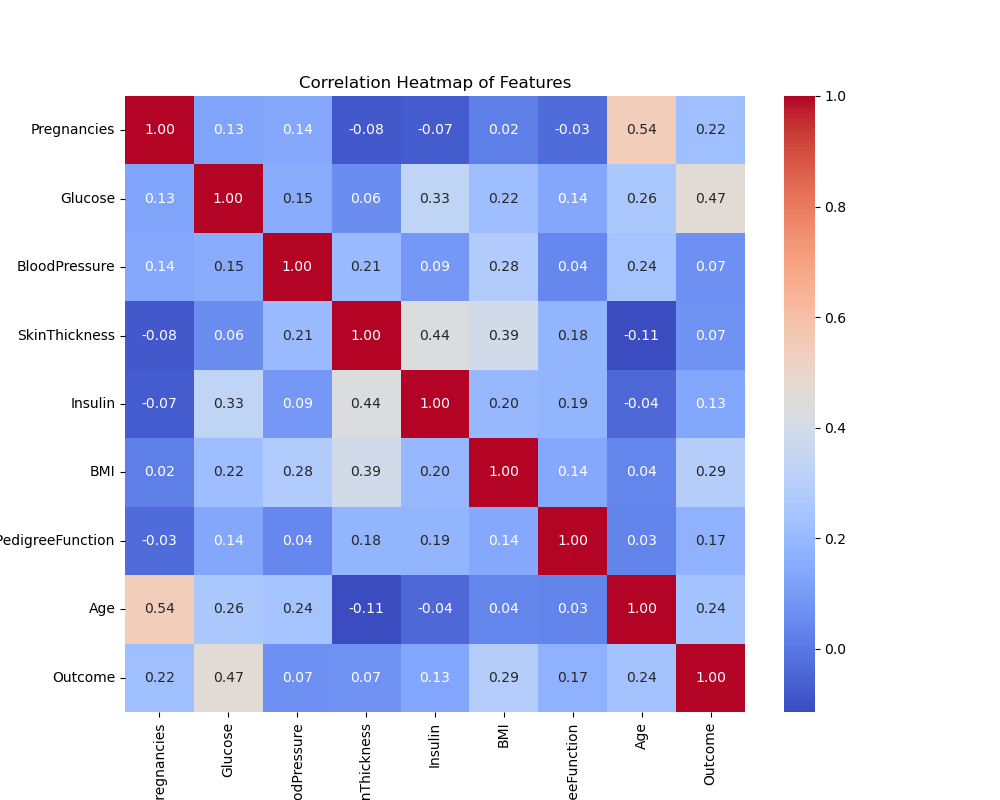
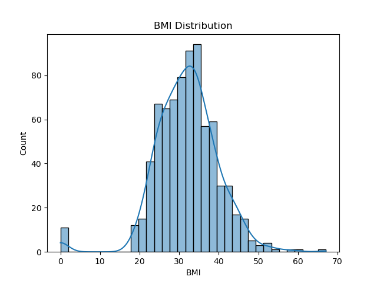
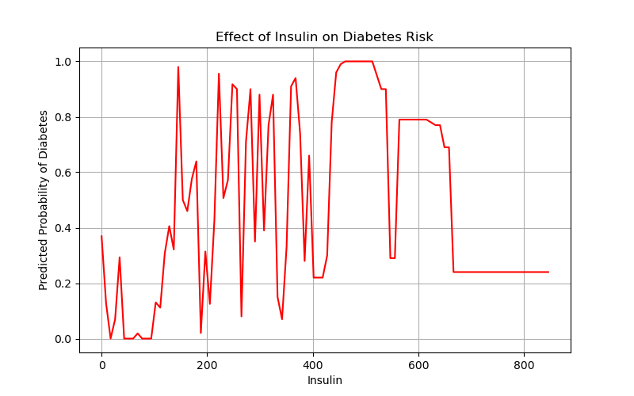
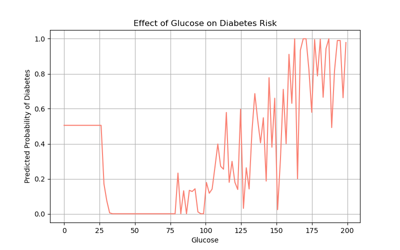

# Diabetes Risk Visualization with ML
I made this project to learn different concepts in prediction and is a simple tool to  visualize different features which is used to predict if the patient has diabetes.

> [!NOTE]
> This repository is a example project I am working on while I learn ML, Visualization and Math for Comp.sci

## Dataset
The features available in the dataset and which are used are as follows
- `Pregnancies`
- `Glucose`
- `BloodPressure`
- `SkinThickness`
- `Insulin`
- `BMI`
- `DiabetesPedigreeFunction`
- `Age`
- `Outcome` (target: 1 = diabetic, 0 = non-diabetic)

## Outputs
### Diabetic vs Non-Diabetic

### Correlation of features

### BMI Distribution in population

## Feature-based
### Risk factor on insulin levels

### Risk factor on glucose levels
